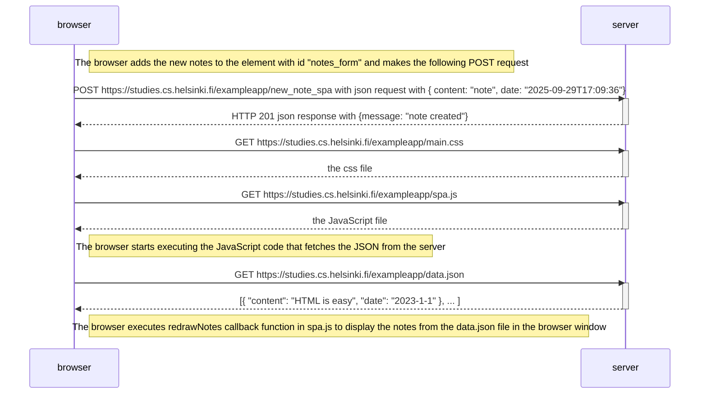

```mermaid

sequenceDiagram
    participant browser
    participant server

    Note right of browser: The browser adds the new notes to the element with id "notes_form" and makes the following POST request

    browser->>server: POST https://studies.cs.helsinki.fi/exampleapp/new_note_spa with json request with { content: "note", date: "2025-09-29T17:09:36"}
    activate server
    server-->>browser: HTTP 201 json response with {message: "note created"}
    deactivate server

    browser->>server: GET https://studies.cs.helsinki.fi/exampleapp/main.css
    activate server
    server-->>browser: the css file
    deactivate server

    browser->>server: GET https://studies.cs.helsinki.fi/exampleapp/spa.js
    activate server
    server-->>browser: the JavaScript file
    deactivate server

    Note right of browser: The browser starts executing the JavaScript code that fetches the JSON from the server

    browser->>server: GET https://studies.cs.helsinki.fi/exampleapp/data.json
    activate server
    server-->>browser: [{ "content": "HTML is easy", "date": "2023-1-1" }, ... ]
    deactivate server

    Note right of browser: The browser executes redrawNotes callback function in spa.js to display the notes from the data.json file in the browser window
```
